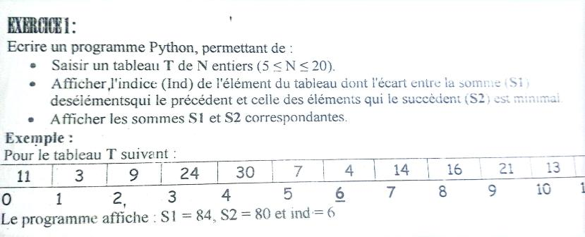

# exercice 1




```pascal
procedure saisir ()
debut
repeter
lire(N)
jusqua 5<=N et N<=20
fin
procedure remplire(@T:tab,N:entier)
debut
pour i de 0 a N-1 faire
T[i] <-- alea(10,50)
finpour
fin
procedure Calcul(T:tab,N:entier,ind:entier)
debut
right <-- 0
left  <-- 0
pour i de 0 a ind faire
left <-- left + T[i]
finpour
pour i de ind+1 a N-1 faire
right <-- right + T[i]
finpour 

retourner abs(left-right)

fin

fonction chercher(T:tab,N:entier):entier
debut
index <-- 1
pour i de 1 a N-1 faire
si Calcul(T,N,i) < Calcul(T,N,index) alors
index <-- i
finsi
finpour
ecrire(index )
fin
saisir()
remplire(T,N)
chercher(T,N)
ecrire(T)
```